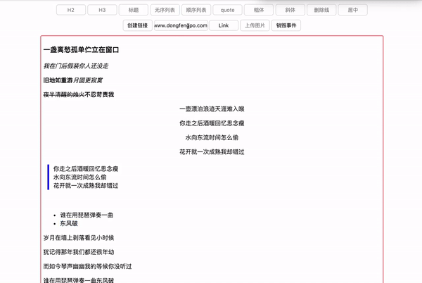
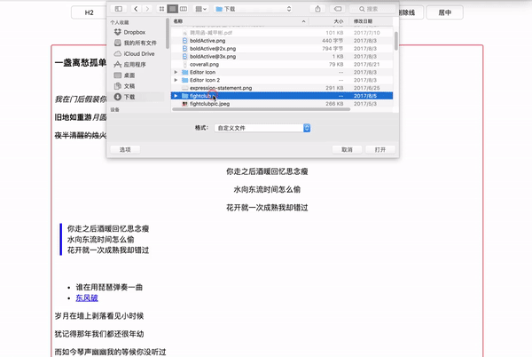

# more-editor
 v 1.0

 **所见即所得的 web 富文本编辑器，特点是只暴露编辑命令的接口，用户交互与用户界面可由开发者自定义。**
 <hr>

 ## 开始使用

 ### 调试
 1. 在项目根目录下运行 ```npm install``` 安装依赖包。
 2. 在项目根目录下运行 ```gulp``` 、 ```npm run test``` 、或者手动打开 ```dist/demo/index.html```。

 ### 使用
 1. 在你的编辑器页面引入  ```dist/js/more-editor.js```
 2. 在你的编辑页面引入    ```dist/css/more-editor.css```
 3. 在你的编辑页面引入 ```dist/css/ui.css```
 4. 初始化编辑器：
 ```
 editorConfig = {

  /* 
    编辑器上传图片时会调用这个函数，请将上传图片的语句写在这个函数中。
    这个函数提供的第一个参数是要上传的源文件，上传完成后得到线上地址，调用第二个参数，将线上地址传进去。
    如果上传失败，调用第三个参数（updateURL 和 failAlert 是两个编辑器里的内置函数）
  */

  imageUpload: function(image, updateURL,failAlert){
    // 上传图片时调用这个函数
  },


  ／* 
    重新编辑帖子的时候，将 editable div 中的内容转换为我们可以编辑的形式。比如帖子中一张图片是
    <div></div>
    我们需要转换成
    <figure data-type="more-editor-inserted-image" class="more-editor-inserted-image" contenteditable="false">
      <li data-type="image-placeholder" class="image-placeholder" contenteditable="true"></li>
      <div class="image-wrapper"></div>
    </figure>
  *／

  initReedit: function(editableElement) {
    // 在这个函数中将需要再编辑的帖子的 html 转换成我们可以编辑的格式，第一个参数是编辑器 DOM 元素 <div contenteditable="true"></div>
  },

  canListsBeAligned: false,               // 列表是否可以设置居中,默认不可使列表居中
  sizeAlert:'.size-alert',                // 图片超过规定大小时显示的警告
  anchorPreview: '.anchor-preview',       // 鼠标悬停在 a 标签中时显示一个卡片，用来说明链接地址
  decorateOnlyWhenTextSelected:false,     // 是否开启粗体、斜体直接输入。false: 开启； true: 关闭。
  loadingImg:'.spinner',                  // 图片上传时显示一个元素表示上传中


  /* 各种命令按钮的 class 类名 */

  buttons: {
    h2: '.h2',                         // 大标题
    h3: '.h3',                         // 小标题
    switchTitle: '.switch-title',      // 在 段落／大标题／小标题 之间切换
    ul: '.ul',                         // 无序列表
    ol: '.ol',                         // 顺序列表
    quote: '.quote',                   // 引用
    bold: '.bold',                     // 粗体
    italic: '.italic',                 // 斜体
    strike: '.strike',                 // 删除线
    url: '.url',                       // 输入链接地址的 input 框
    link: '.link',                     // 生成链接
    promptLink: '.show-link',          // 用 window.prompt 生成链接
    center: '.center',                 // 居中
    imageInput: '.file-upload',        // 上传图片的 input 按钮
    imageButton: '.upload-image',      // 上传图片的按钮。点击这个按钮会自动触发上传图片的 input-file 框
    imageOptions: '.image-options',    // 在编辑器中点击每张图片时会显示三个按钮，这三个按钮请放在这个 DOM 元素中
    imageRechoose: '.rechoose',        // 重置图片,三个图片处理选项之一
    imageRemove: '.delete',            // 删除图片，三个图片处理选项之一
    figCaption: '.figure-caption'      // 添加图片注释， 三个图片处理选项之一。
  }

}

var editor = MoreEditor.new('.editable', editorConfig)
 ```
<hr>

## 项目文件结构

| 文件／目录      | 说明                |
| ------------- | ------------------- |
| __dist__      | 用来存放编译后的文件   |
| __src__       | 存放源文件           |
| .eslintignore | eslint 配置文件      |
| .eslint.json  | eslint 配置文件      |
| .gitignore    | git 配置文件         |
| gulpfile.js   | gulp 配置文件        |
| package.json  | 项目配置文件         |
| readme.md     | 项目说明文档         |

```
dist
 |
 |__css
 |   |__ui.css               demo 页面的样式文件。
 |   |
 |   |__more-editor.css      编辑器样式文件。
 |  
 |__ demo
 |    |
 |    |__index.html          demo 页面，引入了本项目的编辑器，双击点开即可调试。 
 |
 |__ js
     |
     |__more-editor.js       编译后的供生产使用的 JavaScript 文件。


 src
  |
  |__ js
  |   |
  |   |__*.js                各种 JavaScript 源文件, 最终合并成 ／dist/js/more-editor.js。
  |
  |__ sass
       |
       |__ui.scss            demo 页面样式文件，每次修改后用 gulp 编译到  /dist/css/ui.css。
       |
       |__more-editor.scss   编辑器样式文件，每次修改后用 gulp 编译到  /dist/css/more-editor.css。

```


## 功能逻辑

## 1. 功能概述

- 基础功能
  - 段落
  - 标题
  - 列表
  - 引用
  - 链接
  - 加粗
  - 斜体
  - 删除线
  - 居中
- 高阶功能
  - 拖拽／上传 图片
  - 粘贴文本
  - 撤销与重做
  - 快捷键操作

### paste


### title


### italic


### bold


### strikeThrough


### transform


### center


### quote


### ul


### anchor


### image


### undo


## 2. 文本结构

  - 标题
    - 纯文本
  - 段落
    - 装饰文本／链接
  - 列表
    - 装饰文本／链接
  - 引用
    - 装饰文本／链接
  - 图片

## 3. 编辑规则

### 选区

选区不能跨越块级元素，否则功能无法使用。即只有当用户的选区在 **一个标题**／**一个段落**／**一个列表项** 中的时候，各种功能才可用。

exlusion: 可以选中多段执行 **删除**、**回车** 和 **粘贴**。

### 装饰文本

装饰文本不能嵌套使用。这里的装饰文本是指 **加粗**／**斜体**／**删除线**。 装饰一个字符，只能在这三种方式中选一个，不能多选。或者说同一个字不能既加粗又斜体。

当用户选中一段文字并执行加粗时，程序会判断选中的第一个字是否是粗体，如果不是，把选中的文字加粗，如果第一个字已经加粗，则将选中的文字中的粗体全部改为纯文本。这个命令相当于：执行加粗或者取消加粗，如果选区的第一个字符没有加粗，把选区所有的字符变成粗体，并取消其中的斜体和删除线；如果第一个字符已经加粗，则把选区所有已经加粗的文字变成纯文本。

### 列表

段落可以转换成顺序列表和无序列表。

顺序列表可以转换成段落和无序列表。

无序列表可以转换成段落或顺序列表。

无序列表、顺序列表、段落之间的转换的最低单位是 顶级块元素。 即如果用户选中无序列表的一个列表项并执行生成顺序列表命令，整个无序列表都会变成顺序列表。如果用户选中一个列表项并执行转换成文本的命令，整个列表都会转换成文本。即用户不能只转换一个列表项。

### 引用

本项目中用无序列表实现引用（给无序列表添加一些样式使它看起来像在引用一段话）。生成引用和生成无序列表命令不同的地方在于：
1. 引用会拥有一个 blockquote 的类名，一个 data-type=true 的属性。
2. 引用只能转换成文本，不能转换成顺序列表。

另外，编辑完成后上传到将 html 上传到服务端时，你可能需要手动把 ```<ul class="blockquote"><li>aaa</li></ul>``` 转换成 ```<blockquote>aaa</blockquote>```。

我可能会在 2.0 版本中去掉用无序列表产生引用的形式，直接生成 blockquote 标签。

### 链接

产生链接有两种方式，在文本中键入一个 http/https 链接，按下 **空格** 或者 **回车** 会自动产生一个链接。

在一个块元素中选中一段文字（不能是标题），在 链接输入框输入链接地址，可以生成一个链接。

当你选中的文字处在一个链接之中，或者你选中的文字中的一小段文字已经设置了一个链接，再或者你选中的文字的开始或结束部分与已经设置链接的文字有交叉，浏览器会自动处理这些情况，默认情况下新的链接会覆盖掉旧的链接，虽然我们并不推荐这样操作。

我没有提供删除链接的 API， 你只需像删除文字一样删除掉链接文字就可以了。

### 在键盘上按下 ENTER 或 BACKSPACE

**选中了文字的情况下**：

- 按下退格，默认删除。
- 按下回车，浏览器默认操作 **删除并换行**。

**只有一个光标的情况（只列与浏览器默认行为冲突的部分）**：

- 在列表的最后或者唯一一个空列表项按下回车：产生一个新的段落，删除原来的空列表项。
- 其余的空列表项（非最后、非唯一）中按下回车：向下产生一行新列表项。
- 第一个或者唯一一个列表项、并且内容为空的或者光标在第一个字前：把列表项的内容放在一个新的段落中，退出列表项。
- 光标在当前段落或者标题的最后时按下回车：向下新产生一个段落。

### 图片

将图片拖入编辑器区域，出现蓝色线条时，松开鼠标，图片会插入在蓝色线条处。

点击上传图片，会在当前光标位置所在的顶级块元素下生成你选中的图片。比如当前你的光标在一个列表项中，点击上传图片，图片会显示在整个列表下方。

点击图片可以聚焦图片。此时敲击回车会在图片下方产生一个新的段落。敲击退格会删除这个图片。

图片注释 ```<figcaption></figcaption>``` ：

1. 在图片注释中最后一个字的后面按下回车键，退出注释，在下面新起一行段落。
2. 删除图片注释需要再次点击图片上的注释按钮。

### 粘贴

粘贴时文本的样式会被去掉，并匹配当前选区的内容类型。比如在标题中执行粘贴会变成标题。在列表中粘贴时内容会变成列表项。

文本中如果有换行，粘贴后也会显示成新的一行。

不支持粘贴图片。

### 撤销与重做

快速渐入一段英文，渐入一段中文，执行一个编辑命令，这些行为都会被编辑器记录到撤销栈中。cmd+Z 可以撤销。 cmd+Y 与 cmd+shift+Z 可以重做。

最多连续撤销或者重做 20 次。


